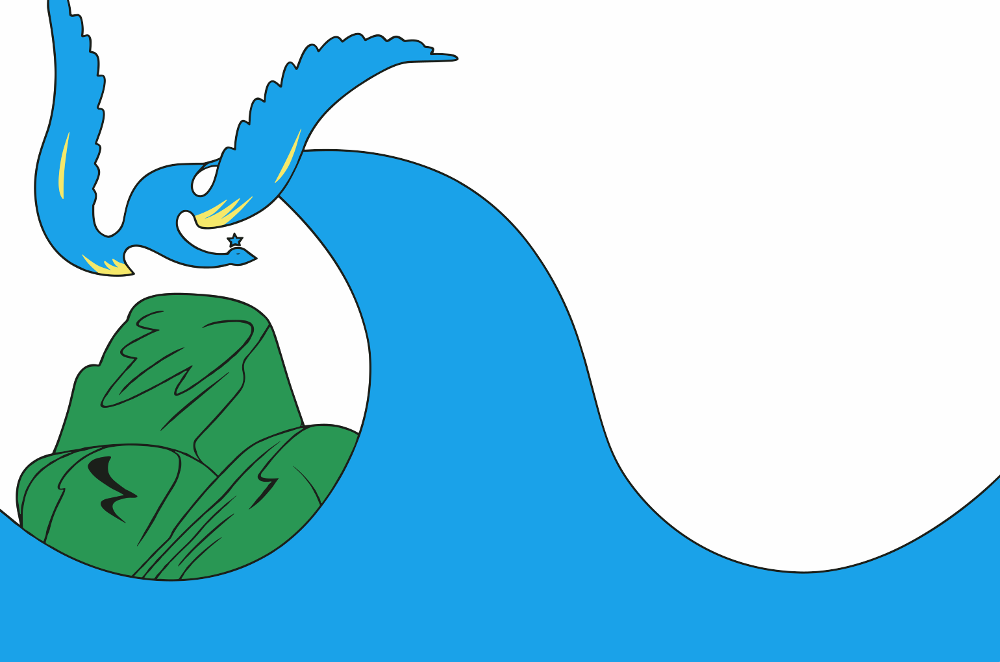
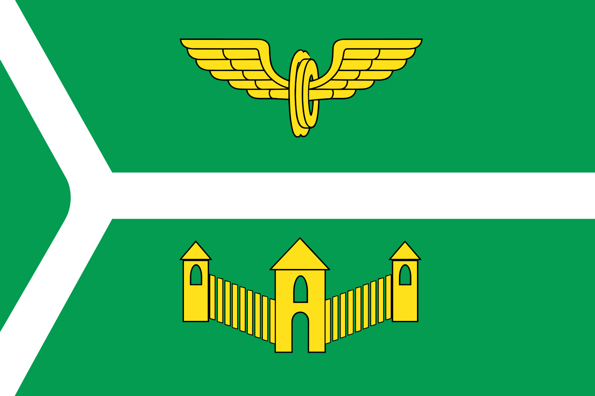
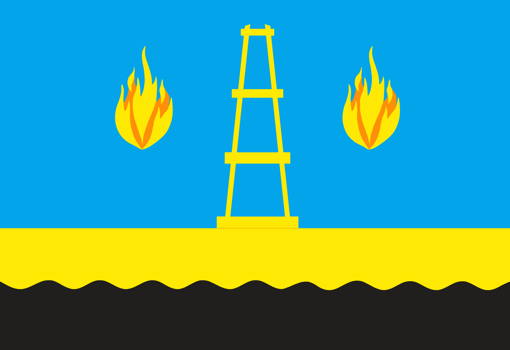
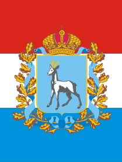
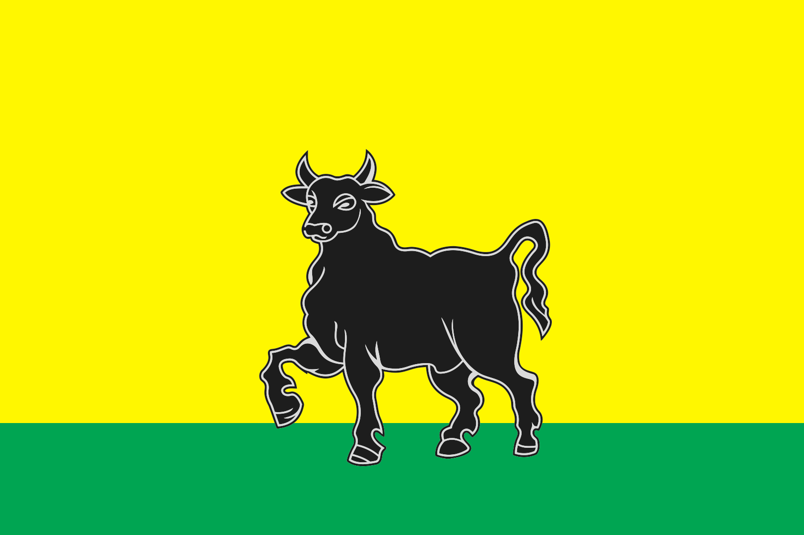
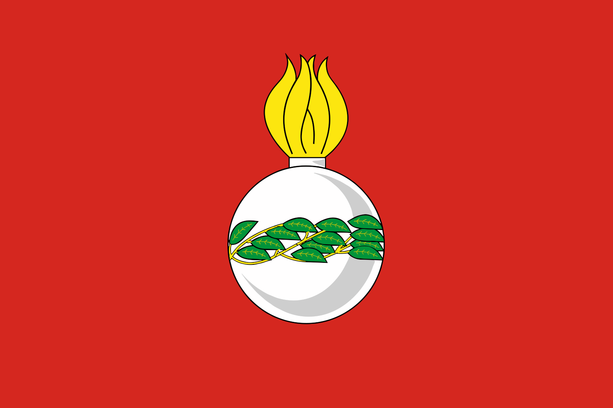

# @russian-flags/samara-oblast

[English version](./README.en.md)

Нативная ESM-коллекция SVG-флагов городов Самарской области. Пакет можно использовать как npm-зависимость в JavaScript/TypeScript-проекте или как набор SVG-файлов с ленивыми загрузчиками.

Список основан на странице Wikipedia ["Городские населённые пункты Самарской области"](https://ru.wikipedia.org/wiki/Городские_населённые_пункты_Самарской_области), раздел "Города": 11 городов. Посёлки городского типа не включены.

## Города

| Город | Флаг | slug |
| --- | --- | --- |
| Жигулёвск |  | `zhigulevsk` |
| Кинель |  | `kinel` |
| Нефтегорск |  | `neftegorsk` |
| Новокуйбышевск |  | `novokuybyshevsk` |
| Октябрьск |  | `oktyabrsk` |
| Отрадный |  | `otradnyy` |
| Похвистнево |  | `pohvistnevo` |
| Самара |  | `samara` |
| Сызрань |  | `syzran` |
| Тольятти |  | `tolyatti` |
| Чапаевск |  | `chapaevsk` |

## Возможности

- 11 локальных SVG-флагов в структуре `assets/<slug>/index.svg`.
- ESM-сборка с TypeScript-типами.
- Ленивые загрузчики для каждого флага.
- Поиск города по slug, коду, русскому/английскому названию или alias.
- Прямой импорт SVG через `flags/<slug>` или `svg/<slug>`.

## Установка

```bash
npm install @russian-flags/samara-oblast
```

Для локальной проверки из папки проекта:

```bash
npm install .
```

## Быстрый старт

```js
import { loadFlag, settlements } from "@russian-flags/samara-oblast";

console.log(settlements.length); // 11

const image = await loadFlag("samara", {
  alt: "Флаг Самары",
  className: "flag",
});

document.body.append(image);
```

## Подключение SVG напрямую

```js
import samaraFlag from "@russian-flags/samara-oblast/flags/samara";
import samaraSvg from "@russian-flags/samara-oblast/svg/samara";

console.log(samaraFlag);
console.log(samaraSvg);
```

Вариант с расширением тоже поддерживается:

```js
import samaraFlag from "@russian-flags/samara-oblast/flags/samara.svg";
import samaraSvg from "@russian-flags/samara-oblast/svg/samara.svg";
```

## Поиск города

```js
import {
  resolveSettlementSlug,
  settlementSlugs,
  settlements,
} from "@russian-flags/samara-oblast";

console.log(settlementSlugs.includes("samara")); // true
console.log(resolveSettlementSlug("Самара")); // "samara"
console.log(resolveSettlementSlug("Togliatti")); // "tolyatti"
console.log(resolveSettlementSlug("Безенчук")); // undefined
```

Ввод нормализуется: пробелы по краям удаляются, регистр не важен, `ё` считается как `е`, пробелы и `_` заменяются на `-`.

## API

| Экспорт | Описание |
| --- | --- |
| `settlements` | Массив метаданных `{ slug, code, nameRu, nameEn, aliases }`. |
| `settlementSlugs` | Массив всех доступных slug. |
| `normalizeSettlementInput(input)` | Нормализует пользовательский ввод перед поиском. |
| `resolveSettlementSlug(input)` | Возвращает slug по slug, коду, названию или alias. |
| `getFlagModuleLoader(input)` | Возвращает ленивый загрузчик модуля флага или `undefined`. |
| `loadFlagModule(input)` | Лениво импортирует модуль флага. |
| `loadFlagImage(input, options)` | Загружает флаг и возвращает `HTMLImageElement`. |
| `loadFlag(input, options)` | Алиас для `loadFlagImage`. |
| `preloadFlag(input)` | Запускает загрузку модуля без ожидания результата. |
| `createFlagImage(src, defaultAlt, options)` | Создаёт и настраивает `` для SVG-флага. |

## Разработка

```bash
npm install
npm test
npm run pack:dry
```
